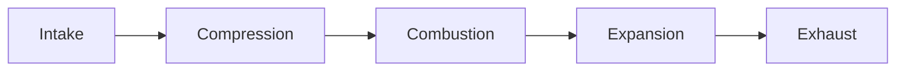

# Типы артефактов - полная классификация

Добро пожаловать в **Artifact System Guide**! 🎓

В этом курсе вы изучите ВСЕ типы интерактивных артефактов - от простых текстовых схем до продвинутых 3D-визуализаций.

---

## 🤔 Что такое артефакты?

**Артефакты** - это интерактивные компоненты, которые усиливают обучение через визуализацию:

- 📊 Графики и диаграммы
- 🧮 Калькуляторы с живыми расчётами
- 🎨 Интерактивные UI компоненты
- 🎬 Анимированные симуляции
- 🎮 3D визуализации

**Зачем нужны артефакты?**
- ✅ Показать сложные концепции визуально
- ✅ Дать возможность экспериментировать с параметрами
- ✅ Сделать обучение интерактивным и увлекательным

---

## 📊 6 уровней сложности артефактов

От простого к сложному:

```
Level 1: ASCII/Text       ⭐
  → Простые текстовые схемы

Level 2: Markup           ⭐⭐
  → HTML, SVG, Mermaid диаграммы

Level 3: Static Charts    ⭐⭐⭐
  → Plotly.js, Chart.js (интерактивные графики)

Level 4: React Static     ⭐⭐⭐
  → Recharts, shadcn/ui (современный дизайн)

Level 5: React Animated   ⭐⭐⭐⭐
  → Анимации, stepping, симуляции

Level 6: 3D/Realtime      ⭐⭐⭐⭐⭐
  → Three.js, WebGL, физика
```

---

## 📋 Детальная классификация

### **Level 1: ASCII / Text-based** ⭐

**Что это:** Схемы из текстовых символов

**Пример:**
```
┌──────────────┐
│   Intake     │  1→2
├──────────────┤
│ Compression  │  2→3
├──────────────┤
│ Combustion   │  3→4
├──────────────┤
│  Expansion   │  4→5
├──────────────┤
│   Exhaust    │  5→6
└──────────────┘
```

**Когда использовать:**
- ✅ Простые схемы
- ✅ Быстрые наброски
- ✅ Документация

**Плюсы:**
- Очень быстро создать
- Работает везде
- Не требует библиотек

**Минусы:**
- Ограниченные визуальные возможности
- Нет интерактивности
- Нет цвета

**Статус:** ❌ Не реализовано (показываем в Markdown)

---

### **Level 2: Markup (HTML, SVG, Mermaid)** ⭐⭐

#### 2A: HTML страницы

**Что это:** Веб-страницы с HTML + CSS + JavaScript

**Когда использовать:**
- Простые интерактивные формы
- Встраивание видео/медиа
- Не нужны сложные фреймворки

**Плюсы:**
- Знакомая технология
- Полный контроль над DOM

**Минусы:**
- Сложно поддерживать при росте
- Нет реактивности

**Статус:** ⚠️ Частично реализовано (iframe)

---

#### 2B: SVG диаграммы

**Что это:** Scalable Vector Graphics - масштабируемая векторная графика

**Когда использовать:**
- Иконки и логотипы
- Технические чертежи
- Схемы, не требующие сложной интерактивности

**Плюсы:**
- Бесконечная масштабируемость
- Маленький размер
- Можно анимировать через CSS

**Минусы:**
- Ограниченная интерактивность

**Статус:** ❌ Не реализовано

---

#### 2C: Mermaid диаграммы

**Что это:** Text-to-diagram - диаграммы из текста

**Пример:**


**Когда использовать:**
- Блок-схемы
- UML диаграммы
- Flowcharts

**Плюсы:**
- Очень быстро создавать (текстовый формат)
- Много типов диаграмм

**Минусы:**
- Ограниченная кастомизация

**Статус:** ❌ Не реализовано

---

### **Level 3: Static Chart Libraries** ⭐⭐⭐

#### 3A: Plotly.js

**Что это:** Мощная библиотека для интерактивных графиков

**Возможности:**
- Line, Bar, Scatter, 3D plots, Heatmaps
- Встроенный zoom/pan
- Интерактивные tooltips

**Когда использовать:**
- Научные графики
- Статистические визуализации
- Нужен быстрый результат

**Плюсы:**
- ✅ Богатый функционал из коробки
- ✅ Встроенная интерактивность
- ✅ 3D графики

**Минусы:**
- ❌ Большой размер библиотеки
- ❌ Сложно кастомизировать дизайн
- ❌ Нет анимации (timeline)

**Статус:** ✅ **РЕАЛИЗОВАНО** в этом курсе!

**Примеры в следующих уроках:**
- Урок 1.3: Plotly.js - графики и примеры

---

#### 3B: Math.js Калькуляторы

**Что это:** Математические расчёты с живыми параметрами

**Возможности:**
- Формулы с переменными
- Слайдеры для изменения параметров
- Автоматический пересчёт

**Когда использовать:**
- Демонстрация формул
- Конвертеры единиц
- Интерактивные расчёты

**Статус:** ✅ **РЕАЛИЗОВАНО** в этом курсе!

**Примеры в следующих уроках:**
- Урок 1.4: Math.js калькуляторы

---

### **Level 4: React-based Static** ⭐⭐⭐

#### 4A: Recharts

**Что это:** React-библиотека для графиков с современным дизайном

**Чем отличается от Plotly:**
- React-компоненты (не canvas)
- SVG-based рендеринг
- Легко кастомизировать
- Современный дизайн

**Когда использовать:**
- Нужен современный UI
- Интеграция с React-экосистемой
- Кастомный дизайн графиков

**Сравнение:**

| Plotly.js | Recharts |
|-----------|----------|
| Canvas-based | SVG-based |
| Много функционала | Простота + гибкость |
| Большой размер | Компактный |
| Сложно стилизовать | Легко кастомизировать |

**Статус:** ❌ Не реализовано (планируется)

**Примеры в следующих уроках:**
- Урок 1.5: Recharts - современные графики

---

#### 4B: UI компоненты (Tailwind + shadcn/ui)

**Что это:**
- **Tailwind CSS** - utility-first CSS framework
- **shadcn/ui** - библиотека готовых компонентов
- **Lucide Icons** - иконки для UI

**Зачем нужно?**

**Проблема:** Создать красивую кнопку = 50+ строк CSS

**Решение 1 - Tailwind CSS:**
```jsx
<button className="bg-blue-500 px-4 py-2 rounded-lg hover:bg-blue-600">
  Кнопка
</button>
```

**Решение 2 - shadcn/ui:**
```jsx
<Button variant="destructive">Удалить</Button>
```

**Когда использовать:**
- ✅ Быстрый современный дизайн
- ✅ Не хочется писать CSS
- ✅ Нужна консистентность UI

**Статус:** ❌ Не реализовано (планируется)

**Примеры в следующих уроках:**
- Урок 1.6: UI компоненты и стилизация

---

### **Level 5: React Animated** ⭐⭐⭐⭐

**Что это:** Анимированные диаграммы с пошаговой симуляцией

**Возможности:**
- Play/Pause/Reset кнопки
- Stepping через фазы
- Интерактивные параметры (sliders)
- Визуализация процессов в реальном времени

**Пример - P-V диаграмма:**
- Анимация цикла двигателя
- Изменение степени сжатия в реальном времени
- Подсветка текущей фазы
- Описание каждой точки

**Технологии:**
- Recharts - для графика
- Tailwind CSS - для дизайна
- Lucide Icons - для кнопок
- useState/useEffect - для анимации

**Когда использовать:**
- Обучающие симуляции
- Пошаговые демонстрации
- Инженерные визуализации

**Статус:** ❌ Не реализовано (планируется!)

**Примеры в следующих уроках:**
- Урок 1.7: Анимированные диаграммы

---

### **Level 6: 3D / Realtime** ⭐⭐⭐⭐⭐

**Что это:** 3D графика и физические симуляции

**Технологии:**
- Three.js - 3D визуализации
- WebGL - низкоуровневая графика
- Physics engines - физика

**Примеры:**
- 3D модели двигателей
- Интерактивные 3D сцены
- Физические симуляции

**Когда использовать:**
- 3D модели
- CAD-подобные визуализации
- Виртуальные лаборатории

**Статус:** ❌ Не реализовано (далёкое будущее)

---

## 📊 Сравнительная таблица

| Level | Технология | Сложность | Интерактивность | Анимация | Статус |
|-------|-----------|-----------|----------------|----------|--------|
| 1 | ASCII/Text | ⭐ | ❌ | ❌ | ❌ |
| 2A | HTML | ⭐⭐ | ⚠️ Базовая | ⚠️ | ⚠️ |
| 2B | SVG | ⭐⭐ | ⚠️ | ✅ CSS | ❌ |
| 2C | Mermaid | ⭐⭐ | ❌ | ❌ | ❌ |
| 3A | **Plotly.js** | ⭐⭐⭐ | ✅ Zoom/Pan | ❌ | ✅ **ЕСТЬ!** |
| 3B | **Math.js** | ⭐⭐⭐ | ✅ Слайдеры | ❌ | ✅ **ЕСТЬ!** |
| 4A | Recharts | ⭐⭐⭐ | ✅ | ⚠️ | ❌ Планируется |
| 4B | shadcn/ui | ⭐⭐⭐ | ✅ | ✅ | ❌ Планируется |
| 5 | **React Animated** | ⭐⭐⭐⭐ | ✅ Полная | ✅ **Полная** | ❌ Планируется |
| 6 | Three.js | ⭐⭐⭐⭐⭐ | ✅ | ✅ | ❌ |

---

## 🎯 Как выбрать правильный тип?

### Decision Tree (дерево решений):

```
Нужна простая схема?
├─ Да → Level 1 (ASCII)
└─ Нет → Нужен график?
    ├─ Да → Нужна кастомизация дизайна?
    │   ├─ Да → Level 4 (Recharts)
    │   └─ Нет → Level 3 (Plotly.js)
    └─ Нет → Нужна анимация?
        ├─ Да → Level 5 (React Animated)
        └─ Нет → Нужен 3D?
            ├─ Да → Level 6 (Three.js)
            └─ Нет → Level 2 (HTML/SVG)
```

### Вопросы для выбора:

1. **Насколько сложные данные?**
   - Простые → ASCII/Text
   - Средние → Plotly/Recharts
   - Сложные → React Animated

2. **Нужна интерактивность?**
   - Нет → ASCII, SVG, Mermaid
   - Базовая → Plotly
   - Полная → React components

3. **Нужна анимация?**
   - Нет → Level 1-4
   - Да → Level 5-6

4. **Важен дизайн?**
   - Не очень → Plotly
   - Да → Recharts + Tailwind + shadcn/ui

5. **Нужен 3D?**
   - Да → Three.js
   - Нет → Recharts/Plotly

---

## 📚 Структура курса

В следующих уроках вы изучите каждый уровень с примерами:

| Урок | Уровень | Что изучим |
|------|---------|-----------|
| 1.2 | Level 1-2 | ASCII, HTML, SVG, Mermaid |
| 1.3 | Level 3 | **Plotly.js - графики** ✅ УЖЕ ЕСТЬ |
| 1.4 | Level 3 | **Math.js - калькуляторы** ✅ УЖЕ ЕСТЬ |
| 1.5 | Level 4 | Recharts - современные графики |
| 1.6 | Level 4 | UI компоненты (Tailwind + shadcn) |
| 1.7 | Level 5 | Анимированные диаграммы (P-V пример!) |
| 1.9 | - | Галерея всех примеров |

---

## 💡 Ключевые выводы

1. **Разнообразие типов:** От ASCII до 3D - выбирайте под задачу
2. **Сложность растёт:** Больше возможностей = больше кода
3. **Текущий курс:** Фокус на Level 3-5 (самые полезные)
4. **Образовательная цель:** Понять КОГДА какой инструмент использовать

---

## 🚀 Следующий шаг

**Урок 1.2:** Изучаем простые типы (Level 1-2) - ASCII, HTML, SVG, Mermaid

Узнаете:
- Когда достаточно простых инструментов
- Как создавать схемы без библиотек
- Примеры каждого типа

**Готовы продолжить?** Переходите к Уроку 1.2! →

---

**Автор:** AI Learning Agent Team
**Дата:** 2025-10-19
**Курс:** Artifact System Guide
