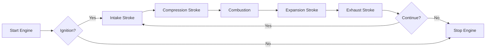
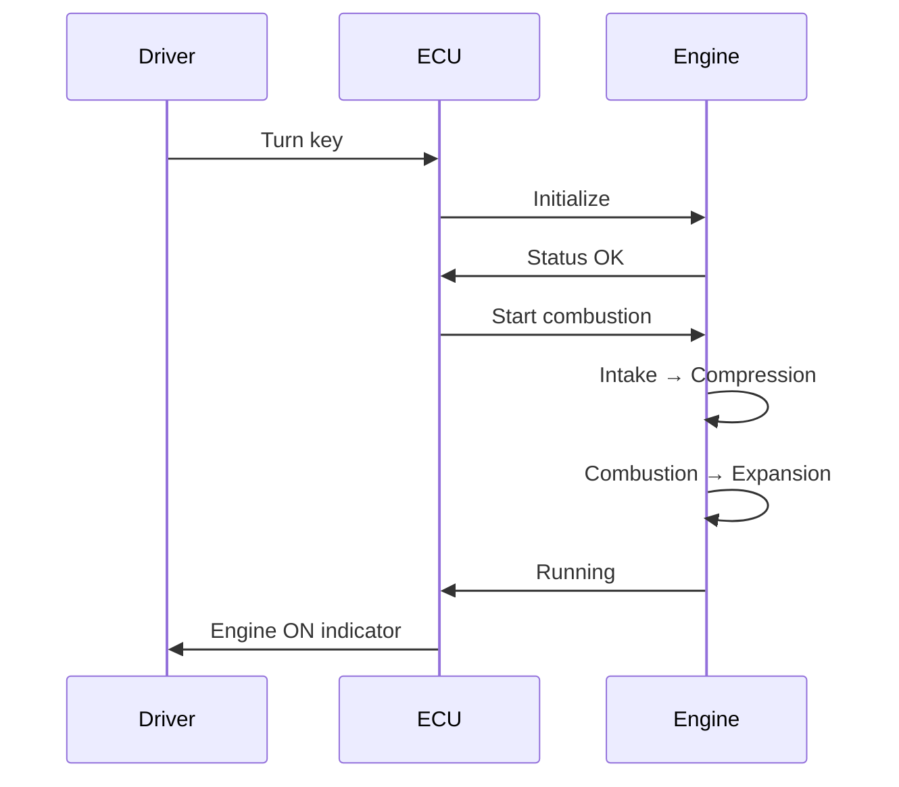
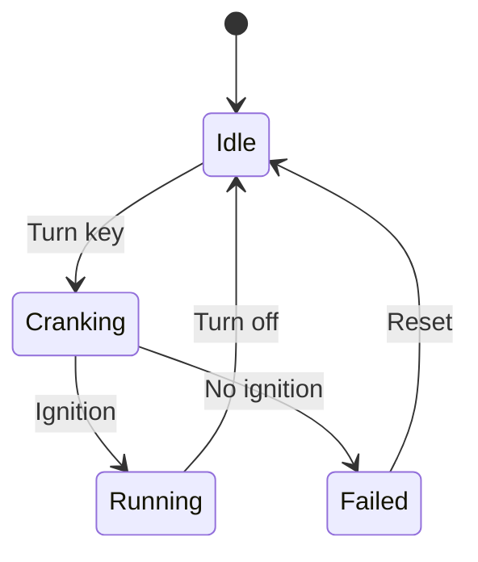

# Level 1-2: Простые типы артефактов

В этом уроке изучим **самые простые** типы артефактов, которые не требуют сложных библиотек.

---

## 🎯 Когда достаточно простых инструментов?

Не всегда нужны сложные графики и анимации! Иногда простая схема решает задачу лучше.

**Используйте простые типы когда:**
- ✅ Нужно быстро показать концепцию
- ✅ Достаточно статичной схемы
- ✅ Интерактивность не требуется
- ✅ Хотите минимальную зависимость от библиотек

---

## Level 1: ASCII / Text-based ⭐

### Что это?

**ASCII диаграммы** - схемы из текстовых символов (box drawing characters).

### Пример: 4-тактный цикл двигателя

```
┌──────────────────────────────┐
│  4-STROKE ENGINE CYCLE       │
└──────────────────────────────┘

    1→2          2→3          3→4          4→5          5→6→1
┌──────────┐ ┌──────────┐ ┌──────────┐ ┌──────────┐ ┌──────────┐
│  INTAKE  │ │COMPRESS  │ │COMBUSTION│ │EXPANSION │ │ EXHAUST  │
│          │ │          │ │          │ │          │ │          │
│  Valve   │ │  Valve   │ │  Valve   │ │  Valve   │ │  Valve   │
│  Open ▼  │ │  Closed  │ │  Closed  │ │  Closed  │ │  Open ▲  │
│          │ │          │ │          │ │          │ │          │
│  Piston  │ │  Piston  │ │  Piston  │ │  Piston  │ │  Piston  │
│    ▼     │ │    ▲     │ │   TDC    │ │    ▼     │ │    ▲     │
│          │ │          │ │          │ │          │ │          │
│  Pressure│ │  Pressure│ │  Pressure│ │  Pressure│ │  Pressure│
│  ~1 bar  │ │  ~15 bar │ │  ~60 bar │ │  ~5 bar  │ │  ~1 bar  │
└──────────┘ └──────────┘ └──────────┘ └──────────┘ └──────────┘
```

### Ещё пример: P-V диаграмма упрощённо

```
Pressure (P)
    │
60 ─┤        ╭─── 3-4 (Combustion)
    │       ╱
40 ─┤      ╱
    │     ╱ 2-3
20 ─┤    ╱ (Compression)
    │   │
10 ─┤   │     4-5
    │   │    ╱ (Expansion)
 5 ─┤   │   ╱
    │   │  ╱
 1 ─┤───┴─╱────────────
    │  1-2   5-6
    └───┴────┴────────► Volume (V)
       50  100  150
```

### Когда использовать ASCII?

**✅ Хорошо для:**
- Документация в коде
- Быстрые наброски концепций
- README файлы
- Terminal UI
- Когда нельзя использовать графику

**❌ Не подходит для:**
- Точные графики с данными
- Интерактивные элементы
- Красивые презентации
- Сложные визуализации

### Плюсы и минусы

| Плюсы | Минусы |
|-------|--------|
| ✅ Очень быстро создать | ❌ Ограниченная красота |
| ✅ Работает везде | ❌ Нет интерактивности |
| ✅ Копируется как текст | ❌ Сложно делать точные схемы |
| ✅ Не требует библиотек | ❌ Ограниченная палитра цветов |

---

## Level 2A: HTML страницы ⭐⭐

### Что это?

**HTML + CSS + JavaScript** - стандартные веб-технологии для создания интерактивных страниц.

### Когда использовать HTML?

**✅ Хорошо для:**
- Простые формы
- Встраивание видео/аудио
- Базовая интерактивность (кнопки, инпуты)
- Когда не нужен React

**❌ Не подходит для:**
- Сложные приложения (лучше React)
- Когда нужна реактивность
- Когда много состояния (state)

### Пример структуры HTML артефакта:

```html
<!DOCTYPE html>
<html>
<head>
  <style>
    body {
      font-family: Arial, sans-serif;
      padding: 20px;
      background: linear-gradient(to right, #667eea 0%, #764ba2 100%);
    }
    .calculator {
      background: white;
      padding: 30px;
      border-radius: 10px;
      box-shadow: 0 4px 6px rgba(0,0,0,0.1);
    }
    .result {
      font-size: 24px;
      color: #667eea;
      margin-top: 20px;
    }
  </style>
</head>
<body>
  <div class="calculator">
    <h2>Simple Speed Calculator</h2>
    <label>Distance (km): <input type="number" id="distance" value="100"></label>
    <label>Time (hours): <input type="number" id="time" value="2"></label>
    <button onclick="calculate()">Calculate Speed</button>
    <div class="result" id="result"></div>
  </div>

  <script>
    function calculate() {
      const distance = document.getElementById('distance').value;
      const time = document.getElementById('time').value;
      const speed = distance / time;
      document.getElementById('result').innerHTML =
        `Speed: ${speed.toFixed(2)} km/h`;
    }
  </script>
</body>
</html>
```

### Плюсы и минусы

| Плюсы | Минусы |
|-------|--------|
| ✅ Знакомая технология | ❌ Сложно при росте кода |
| ✅ Полный контроль | ❌ Нужно вручную обновлять DOM |
| ✅ Можно CDN библиотеки | ❌ Нет реактивности |
| ✅ Быстрый старт | ❌ Сложно поддерживать |

**Статус в проекте:** ⚠️ Частично реализовано (можно рендерить через iframe)

---

## Level 2B: SVG диаграммы ⭐⭐

### Что это?

**SVG (Scalable Vector Graphics)** - масштабируемая векторная графика в XML формате.

### Пример: Простая P-V диаграмма

```xml
<svg width="400" height="300" xmlns="http://www.w3.org/2000/svg">
  <!-- Background -->
  <rect width="400" height="300" fill="#f8f9fa"/>

  <!-- Grid -->
  <line x1="50" y1="250" x2="350" y2="250" stroke="#ddd" stroke-width="2"/>
  <line x1="50" y1="50" x2="50" y2="250" stroke="#ddd" stroke-width="2"/>

  <!-- P-V Cycle Path -->
  <polyline
    points="50,250 150,250 200,100 200,50 70,50 50,250"
    fill="none"
    stroke="#4f46e5"
    stroke-width="3"
  />

  <!-- Key Points -->
  <circle cx="50" cy="250" r="5" fill="red"/>
  <text x="30" y="270" font-size="14">1</text>

  <circle cx="150" cy="250" r="5" fill="red"/>
  <text x="155" y="270" font-size="14">2</text>

  <circle cx="200" cy="100" r="5" fill="red"/>
  <text x="205" y="95" font-size="14">3</text>

  <circle cx="200" cy="50" r="5" fill="red"/>
  <text x="205" y="45" font-size="14">4</text>

  <circle cx="70" cy="50" r="5" fill="red"/>
  <text x="45" y="45" font-size="14">5</text>

  <!-- Labels -->
  <text x="180" y="290" font-size="16" fill="#666">Volume (V)</text>
  <text x="10" y="30" font-size="16" fill="#666">Pressure (P)</text>

  <!-- Title -->
  <text x="150" y="30" font-size="18" font-weight="bold" fill="#111">
    P-V Diagram (Otto Cycle)
  </text>
</svg>
```

### Когда использовать SVG?

**✅ Хорошо для:**
- Иконки и логотипы
- Технические чертежи
- Диаграммы для документации
- Схемы, которые нужно масштабировать

**❌ Не подходит для:**
- Фотореалистичная графика
- Большие объёмы данных (лучше canvas)
- Сложная интерактивность (лучше React)

### Плюсы и минусы

| Плюсы | Минусы |
|-------|--------|
| ✅ Бесконечная масштабируемость | ❌ Сложно для фото |
| ✅ Маленький размер файла | ❌ Ограниченная интерактивность |
| ✅ Можно редактировать (XML) | ❌ Медленно для больших данных |
| ✅ CSS анимация | ❌ Нужно знать координаты |

**Статус в проекте:** ❌ Не реализовано

---

## Level 2C: Mermaid диаграммы ⭐⭐

### Что это?

**Mermaid** - библиотека для создания диаграмм из текста (text-to-diagram).

### Пример 1: Flowchart (блок-схема)



### Пример 2: Sequence Diagram (диаграмма последовательности)



### Пример 3: State Diagram (диаграмма состояний)



### Типы диаграмм Mermaid:

- **Flowchart** - блок-схемы алгоритмов
- **Sequence Diagram** - взаимодействие компонентов
- **Class Diagram** - UML диаграммы классов
- **State Diagram** - диаграммы состояний
- **Gantt Chart** - временные графики
- **Pie Chart** - круговые диаграммы
- **Git Graph** - история коммитов

### Когда использовать Mermaid?

**✅ Хорошо для:**
- Документация процессов
- UML диаграммы
- Блок-схемы алгоритмов
- Быстрые наброски логики

**❌ Не подходит для:**
- Точные графики с данными
- Сложная кастомизация дизайна
- Интерактивные элементы

### Плюсы и минусы

| Плюсы | Минусы |
|-------|--------|
| ✅ Очень быстро (текстовый формат) | ❌ Ограниченная кастомизация |
| ✅ Легко редактировать | ❌ Зависит от библиотеки |
| ✅ Много типов диаграмм | ❌ Не для сложной интерактивности |
| ✅ Git-friendly (текст) | ❌ Автоматическая раскладка |

**Статус в проекте:** ❌ Не реализовано

---

## 🎯 Сравнение Level 1-2

| Тип | Скорость создания | Красота | Интерактивность | Масштабируемость |
|-----|------------------|---------|----------------|-----------------|
| ASCII | ⚡⚡⚡ Мгновенно | ⭐ | ❌ | ⭐⭐ |
| HTML | ⚡⚡ Быстро | ⭐⭐⭐ | ⭐⭐ Базовая | ⭐⭐ |
| SVG | ⚡ Средне | ⭐⭐⭐⭐ | ⭐ Ограниченная | ⭐⭐⭐⭐⭐ |
| Mermaid | ⚡⚡⚡ Мгновенно | ⭐⭐⭐ | ❌ | ⭐⭐⭐ |

---

## 💡 Когда использовать Level 1-2?

### Decision Tree:

```
Нужна интерактивность?
├─ Нет → Нужна красота?
│   ├─ Нет → ASCII (самое быстрое)
│   └─ Да → Нужно масштабирование?
│       ├─ Да → SVG (векторная графика)
│       └─ Нет → Mermaid (из текста)
└─ Да → Базовая (формы, кнопки)?
    ├─ Да → HTML (простые страницы)
    └─ Нет → Level 3+ (Plotly, React)
```

---

## 🚀 Следующий шаг

В Level 1-2 мы изучили **простые инструменты** для быстрых схем и диаграмм.

**Следующий урок (1.3):** Level 3 - Plotly.js графики

Узнаете:
- Интерактивные графики с zoom/pan
- Многофункциональные визуализации
- Когда переходить с простых схем на графики

**Готовы к более мощным инструментам?** Переходите к Уроку 1.3! →

---

**Автор:** AI Learning Agent Team
**Дата:** 2025-10-19
**Курс:** Artifact System Guide
