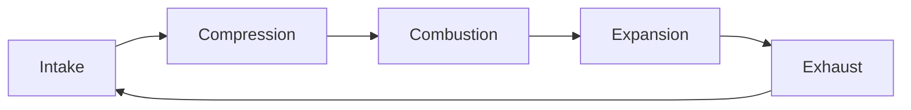

# Artifact Types Taxonomy - Полная классификация артефактов

**Document Version:** 1.0
**Date:** 2025-10-19
**Author:** AI Learning Agent Team

---

## 🎯 Цель документа

Классифицировать ВСЕ возможные типы артефактов от самого простого до самого сложного, чтобы понимать:
- Какие типы артефактов существуют
- Чем они отличаются (технологии, сложность, возможности)
- Когда использовать каждый тип
- Как они соотносятся с текущей реализацией

---

## 📊 Общая классификация

### По уровню сложности (от простого к сложному):

```
Level 1: ASCII/Text       → Простой текст, таблицы, схемы
Level 2: Markup           → HTML, SVG, Mermaid
Level 3: Static Libraries → Plotly, Chart.js (без анимации)
Level 4: Interactive      → React + базовые хуки (useState)
Level 5: Advanced         → React + анимация + сложная логика
Level 6: 3D/Realtime      → Three.js, WebGL, физика
```

### По технологии рендеринга:

```
Text-based    → ASCII, Markdown
Markup        → HTML, SVG, Mermaid
Canvas-based  → Plotly, Chart.js
React-based   → Recharts, shadcn/ui, custom components
WebGL-based   → Three.js, 3D graphics
```

---

## 📋 Детальная классификация

---

### **Level 1: ASCII / Text-based артефакты**

**Технологии:** Чистый текст, Unicode символы

**Примеры:**
- ASCII диаграммы (box drawing)
- Таблицы в Markdown
- Flowcharts из символов
- ASCII art

**Пример:**
```
┌─────────────┐
│   Intake    │  1→2
├─────────────┤
│ Compression │  2→3
├─────────────┤
│ Combustion  │  3→4
├─────────────┤
│  Expansion  │  4→5
├─────────────┤
│   Exhaust   │  5→6
└─────────────┘
```

**Когда использовать:**
- Простые схемы
- Быстрые наброски
- Документация в коде
- Terminal UI

**Преимущества:**
- ✅ Очень быстро создать
- ✅ Работает везде (даже в терминале)
- ✅ Легко копировать/вставлять
- ✅ Не требует библиотек

**Недостатки:**
- ❌ Ограниченные визуальные возможности
- ❌ Нет интерактивности
- ❌ Нет цвета (или ограниченная палитра)

**MIME Type:** `text/plain`

**Статус в проекте:** ❌ Не реализовано (можно добавить в Markdown уроков)

---

### **Level 2A: HTML-страницы**

**Технологии:** HTML + CSS + Vanilla JS

**Примеры:**
- Статические веб-страницы
- Формы с валидацией
- Простые интерактивные элементы
- Встроенные видео/аудио

**Пример структуры:**
```html
<!DOCTYPE html>
<html>
<head>
  <style>
    .container { padding: 20px; }
    .button { background: blue; color: white; }
  </style>
</head>
<body>
  <div class="container">
    <h1>Интерактивная форма</h1>
    <button class="button" onclick="calculate()">Рассчитать</button>
    <div id="result"></div>
  </div>
  <script>
    function calculate() {
      document.getElementById('result').innerHTML = 'Результат: 42';
    }
  </script>
</body>
</html>
```

**Когда использовать:**
- Простые интерактивные страницы
- Формы ввода данных
- Встраивание видео/медиа
- Не нужны React-компоненты

**Преимущества:**
- ✅ Знакомая технология
- ✅ Полный контроль над DOM
- ✅ Можно использовать CDN библиотеки (только cdnjs.cloudflare.com)
- ✅ Легко отладить

**Недостатки:**
- ❌ Сложно поддерживать при росте кода
- ❌ Нет реактивности (нужно вручную обновлять DOM)
- ❌ Ограничения безопасности (iframe sandbox)

**MIME Type:** `text/html`

**Статус в проекте:** ⚠️ Частично реализовано (можно рендерить через iframe)

---

### **Level 2B: SVG-изображения**

**Технологии:** Scalable Vector Graphics

**Примеры:**
- Иконки
- Логотипы
- Диаграммы (статичные)
- Технические чертежи
- Анимированные SVG

**Пример:**
```xml
<svg width="200" height="200" xmlns="http://www.w3.org/2000/svg">
  <!-- P-V цикл упрощённый -->
  <polyline
    points="50,150 150,150 180,50 180,20 50,20 50,150"
    fill="none"
    stroke="blue"
    stroke-width="2"
  />
  <circle cx="50" cy="150" r="4" fill="red" />
  <text x="40" y="170">1</text>
  <circle cx="150" cy="150" r="4" fill="red" />
  <text x="140" y="170">2</text>
</svg>
```

**Когда использовать:**
- Масштабируемая графика
- Иконки и логотипы
- Технические схемы
- Простые анимации (через CSS/SMIL)

**Преимущества:**
- ✅ Бесконечная масштабируемость
- ✅ Маленький размер файла
- ✅ Легко редактировать (XML)
- ✅ Можно анимировать через CSS

**Недостатки:**
- ❌ Сложно для фото-реалистичной графики
- ❌ Ограниченная интерактивность
- ❌ Может быть медленным для больших данных

**MIME Type:** `image/svg+xml`

**Статус в проекте:** ❌ Не реализовано

---

### **Level 2C: Mermaid диаграммы**

**Технологии:** Mermaid.js (text-to-diagram)

**Примеры:**
- Flowcharts (блок-схемы)
- Sequence diagrams (диаграммы последовательности)
- Gantt charts (диаграммы Ганта)
- Class diagrams (UML)
- State diagrams (диаграммы состояний)

**Пример:**


**Когда использовать:**
- Быстрые диаграммы из текста
- Блок-схемы алгоритмов
- UML диаграммы
- Документация процессов

**Преимущества:**
- ✅ Очень быстро создавать (текстовый формат)
- ✅ Легко редактировать
- ✅ Много типов диаграмм
- ✅ Генерация из кода

**Недостатки:**
- ❌ Ограниченная кастомизация
- ❌ Не для сложной интерактивности
- ❌ Зависит от библиотеки

**MIME Type:** `application/vnd.mermaid`

**Статус в проекте:** ❌ Не реализовано

---

### **Level 3: Static Chart Libraries (без React)**

**Технологии:** Plotly.js, Chart.js, D3.js (vanilla)

#### **3A: Plotly.js** (текущая реализация)

**Примеры:**
- Line charts (линейные)
- Bar charts (столбчатые)
- Scatter plots (точечные)
- 3D plots (3D графики)
- Heatmaps (тепловые карты)

**Пример конфигурации:**
```javascript
{
  data: [{
    x: [1, 2, 3, 4, 5],
    y: [10, 15, 13, 17, 20],
    type: 'scatter',
    mode: 'lines+markers',
    marker: { color: 'blue' }
  }],
  layout: {
    title: 'Температура',
    xaxis: { title: 'День' },
    yaxis: { title: '°C' }
  }
}
```

**Когда использовать:**
- Научные графики
- Статистические визуализации
- Быстрые графики из данных
- Встроенный zoom/pan

**Преимущества:**
- ✅ Богатый функционал из коробки
- ✅ Встроенная интерактивность (hover, zoom)
- ✅ 3D графики
- ✅ Много типов графиков

**Недостатки:**
- ❌ Большой размер библиотеки
- ❌ Сложно кастомизировать дизайн
- ❌ Нет анимации (timeline)
- ❌ Не интегрируется с React-экосистемой

**MIME Type:** `application/vnd.plotly`

**Статус в проекте:** ✅ **РЕАЛИЗОВАНО** (Фаза 1-3)

---

#### **3B: Chart.js**

**Примеры:**
- Line, Bar, Radar, Pie, Doughnut, Polar Area, Bubble, Scatter

**Когда использовать:**
- Простые графики
- Меньший размер библиотеки (чем Plotly)
- Canvas-based рендеринг

**Преимущества:**
- ✅ Легковесный
- ✅ Простой API
- ✅ Canvas-based (быстрый)

**Недостатки:**
- ❌ Меньше функционала чем Plotly
- ❌ Нет 3D
- ❌ Ограниченная интерактивность

**MIME Type:** `application/vnd.chartjs`

**Статус в проекте:** ❌ Не реализовано

---

#### **3C: D3.js (vanilla)**

**Примеры:**
- Кастомные визуализации
- Force-directed graphs
- Tree diagrams
- Geographic maps

**Когда использовать:**
- Полный контроль над визуализацией
- Уникальные типы графиков
- Сложные преобразования данных

**Преимущества:**
- ✅ Максимальная гибкость
- ✅ Любые визуализации
- ✅ Мощные инструменты работы с данными

**Недостатки:**
- ❌ Очень сложный API
- ❌ Долго учиться
- ❌ Нужно писать много кода

**MIME Type:** `application/vnd.d3`

**Статус в проекте:** ❌ Не реализовано

---

### **Level 4: React-based Static (без анимации)**

**Технологии:** React + библиотеки (Recharts, shadcn/ui, Lucide icons)

#### **4A: Recharts (React wrapper для графиков)**

**Примеры:**
- LineChart, BarChart, AreaChart, PieChart
- ComposedChart (комбинированные)
- Responsive containers
- Custom tooltips/labels

**Пример:**
```jsx
import { LineChart, Line, XAxis, YAxis, CartesianGrid, Tooltip } from 'recharts';

const data = [
  { name: 'Jan', value: 400 },
  { name: 'Feb', value: 300 },
  { name: 'Mar', value: 600 }
];

<LineChart width={600} height={300} data={data}>
  <CartesianGrid strokeDasharray="3 3" />
  <XAxis dataKey="name" />
  <YAxis />
  <Tooltip />
  <Line type="monotone" dataKey="value" stroke="#8884d8" />
</LineChart>
```

**Когда использовать:**
- React-экосистема
- Нужна кастомизация дизайна
- Responsive дизайн
- Интеграция с UI-библиотеками

**Преимущества:**
- ✅ Идеально интегрируется с React
- ✅ Кастомизируемый дизайн (props)
- ✅ Responsive из коробки
- ✅ Легко добавлять свои компоненты

**Недостатки:**
- ❌ Меньше функционала чем Plotly (нет 3D)
- ❌ Нужен React
- ❌ SVG-based (может быть медленным для больших данных)

**MIME Type:** `application/vnd.react`

**Статус в проекте:** ❌ **НЕ РЕАЛИЗОВАНО** (планируется в Фазе 4)

---

#### **4B: shadcn/ui компоненты**

**Примеры:**
- Alert, Button, Card, Dialog
- Input, Select, Checkbox
- Tabs, Accordion, Dropdown
- Form components

**Пример:**
```jsx
import { Alert, AlertDescription, AlertTitle } from "@/components/ui/alert"
import { Button } from "@/components/ui/button"

<Alert>
  <AlertTitle>Внимание!</AlertTitle>
  <AlertDescription>
    Температура превысила допустимый предел.
  </AlertDescription>
</Alert>
<Button variant="destructive">Остановить двигатель</Button>
```

**Когда использовать:**
- Современный UI
- Формы и интерфейсы
- Быстрая разработка UI
- Tailwind CSS интеграция

**Преимущества:**
- ✅ Готовые красивые компоненты
- ✅ Tailwind CSS
- ✅ Доступность (a11y)
- ✅ Кастомизируемые

**Недостатки:**
- ❌ Нужен Tailwind CSS setup
- ❌ Зависимость от библиотеки
- ❌ Может быть overengineering для простых задач

**MIME Type:** `application/vnd.react`

**Статус в проекте:** ❌ Не реализовано

---

#### **4C: Lucide Icons**

**Примеры:**
- Play, Pause, Stop
- Settings, Info, Alert
- ArrowRight, ChevronDown
- 1000+ иконок

**Пример:**
```jsx
import { Play, Pause, RotateCcw } from 'lucide-react';

<button>
  <Play size={24} />
  Запуск
</button>
```

**Когда использовать:**
- Иконки в UI
- Кнопки управления
- Индикаторы состояния

**Преимущества:**
- ✅ Огромная библиотека иконок
- ✅ React-компоненты
- ✅ Кастомизируемые (size, color, stroke)
- ✅ SVG-based

**Недостатки:**
- ❌ Увеличивает bundle size
- ❌ Нужен tree-shaking

**MIME Type:** `application/vnd.react`

**Статус в проекте:** ❌ Не реализовано

---

### **Level 5: React-based Interactive (с анимацией)**

**Технологии:** React + useState/useEffect + анимация

#### **5A: Animated Diagrams (ваш пример)**

**Примеры:**
- P-V диаграммы с анимацией цикла
- Stepping через фазы
- Real-time обновление графиков
- Интерактивные параметры (sliders)

**Пример структуры:**
```jsx
import { useState, useEffect } from 'react';
import { LineChart, Line, Scatter } from 'recharts';
import { Play, Pause } from 'lucide-react';

const AnimatedPVDiagram = () => {
  const [isAnimating, setIsAnimating] = useState(false);
  const [currentStep, setCurrentStep] = useState(0);
  const [params, setParams] = useState({ compressionRatio: 9 });

  useEffect(() => {
    if (isAnimating) {
      const interval = setInterval(() => {
        setCurrentStep(prev => prev + 1);
      }, 50);
      return () => clearInterval(interval);
    }
  }, [isAnimating]);

  return (
    <div className="bg-gradient-to-br from-gray-900 to-gray-800 p-6">
      <LineChart data={data.slice(0, currentStep)}>
        <Line dataKey="P" stroke="blue" />
        <Scatter data={[currentPoint]} fill="red" />
      </LineChart>

      <button onClick={() => setIsAnimating(!isAnimating)}>
        {isAnimating ? <Pause /> : <Play />}
      </button>

      <input
        type="range"
        value={params.compressionRatio}
        onChange={(e) => setParams({...params, compressionRatio: e.target.value})}
      />
    </div>
  );
};
```

**Когда использовать:**
- Обучающие симуляции
- Пошаговые демонстрации
- Интерактивные визуализации процессов
- Инженерные приложения

**Преимущества:**
- ✅ Полная интерактивность
- ✅ Анимация шаг-за-шагом
- ✅ Параметры в реальном времени
- ✅ Образовательный контекст (фазы, описания)
- ✅ Современный дизайн (Tailwind)

**Недостатки:**
- ❌ Сложнее разрабатывать
- ❌ Больше кода
- ❌ Нужна логика управления состоянием

**MIME Type:** `application/vnd.react`

**Статус в проекте:** ❌ **НЕ РЕАЛИЗОВАНО** (планируется в Фазе 4)

---

#### **5B: Interactive Calculators (advanced)**

**Примеры:**
- Multi-step калькуляторы с wizard UI
- Калькуляторы с визуализацией результатов
- Формы с условной логикой
- Real-time графики результатов

**Когда использовать:**
- Сложные расчёты с множеством шагов
- Нужна визуализация процесса
- Интерактивные обучающие инструменты

**Преимущества:**
- ✅ Сложная бизнес-логика
- ✅ Wizard-подобный UX
- ✅ Визуализация результатов

**Недостатки:**
- ❌ Сложная разработка
- ❌ Много состояния (state management)

**MIME Type:** `application/vnd.react`

**Статус в проекте:** ⚠️ Частично (простые калькуляторы реализованы)

---

#### **5C: React Day Picker (календари)**

**Примеры:**
- Выбор даты
- Date range picker
- Календари событий

**Пример:**
```jsx
import { DayPicker } from 'react-day-picker';
import { format } from 'date-fns';

const [selected, setSelected] = useState();

<DayPicker
  mode="single"
  selected={selected}
  onSelect={setSelected}
/>
```

**Когда использовать:**
- Работа с датами
- Планирование событий
- Фильтры по датам

**Преимущества:**
- ✅ Полнофункциональный календарь
- ✅ date-fns интеграция
- ✅ Локализация

**Недостатки:**
- ❌ Узкоспециализированный
- ❌ Увеличивает bundle size

**MIME Type:** `application/vnd.react`

**Статус в проекте:** ❌ Не реализовано

---

### **Level 6: Advanced 3D/Realtime**

**Технологии:** Three.js, WebGL, Physics engines

#### **6A: Three.js (3D графика)**

**Примеры:**
- 3D модели двигателей
- Интерактивные 3D сцены
- Анимация движения частей
- VR/AR визуализации

**Пример:**
```jsx
import { Canvas } from '@react-three/fiber';
import { OrbitControls, Box } from '@react-three/drei';

<Canvas>
  <ambientLight intensity={0.5} />
  <spotLight position={[10, 10, 10]} />
  <Box args={[1, 1, 1]} />
  <OrbitControls />
</Canvas>
```

**Когда использовать:**
- 3D модели
- CAD-подобные визуализации
- Виртуальные лаборатории
- Инженерные симуляции

**Преимущества:**
- ✅ Полноценная 3D графика
- ✅ WebGL performance
- ✅ Реалистичные визуализации
- ✅ VR/AR поддержка

**Недостатки:**
- ❌ Очень сложно разрабатывать
- ❌ Требует 3D навыков
- ❌ Большой размер библиотек
- ❌ Медленно на слабых устройствах

**MIME Type:** `application/vnd.react`

**Статус в проекте:** ❌ Не реализовано (может быть в будущем для курса по двигателям)

---

#### **6B: Physics Simulations**

**Примеры:**
- Физические симуляции (гравитация, столкновения)
- Fluid dynamics
- Particle systems

**Когда использовать:**
- Физические эксперименты
- Демонстрация законов физики
- Инженерные расчёты

**Преимущества:**
- ✅ Реалистичные симуляции
- ✅ Образовательная ценность
- ✅ Интерактивные эксперименты

**Недостатки:**
- ❌ Очень сложная математика
- ❌ Требует специализированных знаний
- ❌ Производительность

**MIME Type:** `application/vnd.react`

**Статус в проекте:** ❌ Не реализовано

---

## 📊 Сравнительная таблица

| Level | Технология | Сложность | Интерактивность | Анимация | Статус в проекте |
|-------|-----------|-----------|----------------|----------|------------------|
| 1 | ASCII/Text | ⭐ | ❌ | ❌ | ❌ Не реализовано |
| 2A | HTML | ⭐⭐ | ⚠️ Базовая | ⚠️ Базовая | ⚠️ Частично |
| 2B | SVG | ⭐⭐ | ⚠️ Ограниченная | ✅ CSS | ❌ Не реализовано |
| 2C | Mermaid | ⭐⭐ | ❌ | ❌ | ❌ Не реализовано |
| 3A | **Plotly.js** | ⭐⭐⭐ | ✅ Zoom/Pan | ❌ | ✅ **РЕАЛИЗОВАНО** |
| 3B | Chart.js | ⭐⭐⭐ | ⚠️ Базовая | ⚠️ Transitions | ❌ Не реализовано |
| 3C | D3.js | ⭐⭐⭐⭐⭐ | ✅ Полная | ✅ Полная | ❌ Не реализовано |
| 4A | **Recharts** | ⭐⭐⭐ | ✅ Хорошая | ⚠️ Transitions | ❌ Планируется |
| 4B | shadcn/ui | ⭐⭐⭐ | ✅ Полная | ✅ Transitions | ❌ Не реализовано |
| 4C | Lucide Icons | ⭐ | ❌ | ❌ | ❌ Не реализовано |
| 5A | **React Animated** | ⭐⭐⭐⭐ | ✅ Полная | ✅ **Полная** | ❌ **Планируется** |
| 5B | Advanced Calc | ⭐⭐⭐⭐ | ✅ Полная | ✅ Полная | ⚠️ Частично |
| 5C | Date Picker | ⭐⭐ | ✅ Полная | ❌ | ❌ Не реализовано |
| 6A | Three.js | ⭐⭐⭐⭐⭐ | ✅ Полная | ✅ Полная | ❌ Не реализовано |
| 6B | Physics | ⭐⭐⭐⭐⭐ | ✅ Полная | ✅ Полная | ❌ Не реализовано |

---

## 🎯 Что реализовано сейчас (Фазы 1-3)?

### ✅ Реализовано:
- **Level 3A: Plotly.js** - статические графики с zoom/pan
  - Line charts
  - Scatter plots
  - Bar charts
  - Multi-line
  - Area charts

- **Калькуляторы** - простые React компоненты с Math.js
  - Generic calculator
  - Unit converter
  - Formula calculator

### ❌ НЕ реализовано (но доступно в системе):
- ASCII/Text
- HTML страницы
- SVG
- Mermaid
- Chart.js
- D3.js
- Recharts
- shadcn/ui
- Lucide icons
- Анимированные React компоненты
- Three.js

---

## 🚀 План развития (Roadmap)

### **Фаза 4: Advanced Interactive Features** (планируется)

**Цель:** Перейти с Level 3 (Plotly) на Level 5 (React Animated)

**Добавить:**
1. **Recharts** - для современного дизайна графиков
2. **Tailwind CSS** - для стилизации
3. **Lucide Icons** - для UI кнопок
4. **Анимация** - useState/useEffect для stepping
5. **Интерактивные параметры** - sliders, inputs
6. **Образовательный контекст** - фазы, описания, подсказки

**Первый пример:** P-V диаграмма (как в вашем коде)

---

### **Фаза 5: Расширение библиотеки типов**

**Добавить:**
1. **Mermaid** - для быстрых диаграмм
2. **SVG** - для технических чертежей
3. **shadcn/ui** - для форм и UI
4. **Advanced Calculators** - wizard-style

---

### **Фаза 6: 3D и симуляции** (далёкое будущее)

**Добавить:**
1. **Three.js** - для 3D моделей двигателей
2. **Physics** - для симуляций процессов

---

## 💡 Рекомендации

### Для курса "Artifact System Guide":

**Сейчас (Фазы 1-3):**
- ✅ Урок про Plotly графики
- ✅ Урок про Math.js калькуляторы

**Добавить после Фазы 4:**
- ➕ Урок "Типы артефактов: от ASCII до 3D"
- ➕ Урок "Анимированные диаграммы с Recharts"
- ➕ Урок "Современный UI с Tailwind + shadcn"
- ➕ Галерея примеров по уровням сложности

---

### Для курса по двигателям:

**Level 3 (Plotly):**
- Простые графики (temperature, pressure, RPM)
- Статические P-V диаграммы

**Level 5 (React Animated):**
- ✨ Анимированный цикл P-V диаграммы (ваш пример!)
- ✨ Stepping через такты двигателя
- ✨ Интерактивные параметры (compression ratio, fuel type)
- ✨ Визуализация эффективности

**Level 6 (Three.js):**
- 3D модель двигателя
- Анимация движения поршня
- Визуализация потоков

---

## 📝 Выводы

### Текущее состояние:
- Мы находимся на **Level 3** (Plotly.js + простые калькуляторы)
- Это хорошая база для понимания концепции артефактов
- Но есть огромный потенциал роста до Level 5-6

### Следующие шаги:
1. Обновить "Artifact System Guide" с полной таксономией типов
2. Реализовать Фазу 4: переход на Level 5 (React Animated)
3. Создать примеры для разных уровней сложности
4. Документировать все возможности системы

---

**Prepared by:** Claude Code (Sonnet 4.5)
**Date:** 2025-10-19
**Purpose:** Comprehensive taxonomy of artifact types for educational platform
