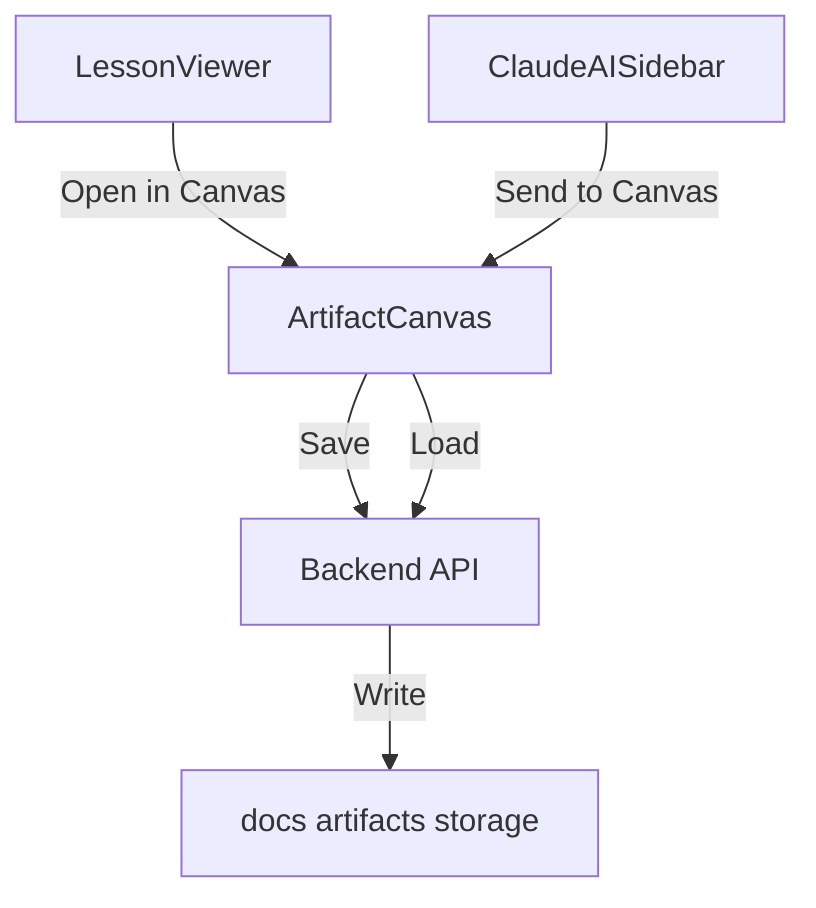
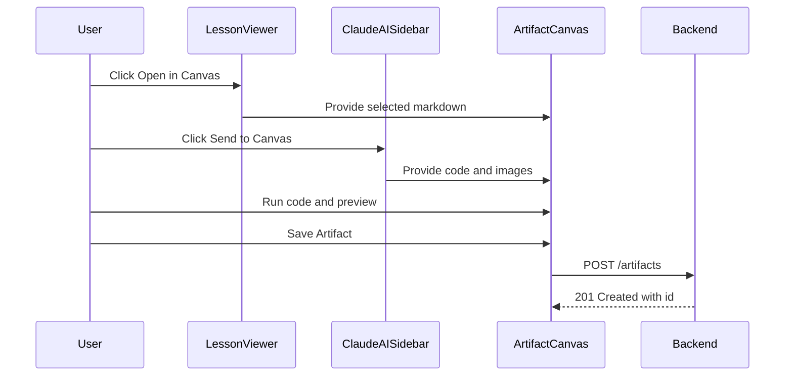

# ARTIFACTS_SPEC — Canvas для демонстрационных уроков

Цель: дать возможность открывать интерактивный холст Canvas рядом с чатом для быстрых демонстраций кода, заметок и изображений на основе уроков и диалогов.

Статус: MVP спецификация к реализации. Источник требований: ваше описание сценария и интерфейса проекта.

## 1. Пользовательские сценарии

- Читаю урок в центре и не понимаю механизм кнопок → жму Open in Canvas → получаю предзаполненный Canvas с фрагментом урока, дописываю код и запускаю.
- Обсуждаю в чате, ИИ прислал код и скриншоты → жму Send to Canvas → вижу код и изображения в Canvas, запускаю и проверяю.
- Сохраняю удачный пример как артефакт в файловую систему, чтобы вернуться позже или сослаться из урока.

## 2. UX и навигация

- Вкладка Canvas в правой панели рядом с чатом: изменяем [ClaudeAISidebar.jsx](frontend/src/components/rightSidebar/ClaudeAISidebar.jsx)
- Кнопка Open in Canvas в центре: изменяем [LessonViewer.jsx](frontend/src/components/center/LessonViewer.jsx)
- Действие Send to Canvas в сообщении чата: изменяем [ClaudeAISidebar.jsx](frontend/src/components/rightSidebar/ClaudeAISidebar.jsx)

### 2.1 Вкладка Canvas

- Три режима: Markdown, Code, Images
- Кнопки: Run code, Clear, Save Artifact, Load Artifact
- Индикация несохраненных изменений

### 2.2 Кнопки интеграций

- Open in Canvas: передает выделенный фрагмент из Markdown урока или весь урок
- Send to Canvas: переносит последний кодовый блок и прикрепленные изображения из выбранного сообщения

## 3. Модель данных артефакта

- Поля: id, title, type markdown or code or images, created_at, updated_at, source lesson or chat, tags []
- Содержимое:
  - type=markdown: markdown текст
  - type=code: html, css, js хранятся как единый HTML с inlined CSS и JS
  - type=images: список data URL или ссылки на сохраненные файлы

Формат хранения: Markdown файл с YAML frontmatter плюс, при type=code, сопутствующий .html файл для быстрого предпросмотра.

Пример frontmatter:

---
id: canvas-2025-10-16-001
title: Демонстрация интерактивной кнопки
type: code
source: chat
tags: [ui, button, event]
created_at: 2025-10-16T21:30:00Z
updated_at: 2025-10-16T21:30:00Z
---

## 4. Frontend архитектура

Новые и изменяемые компоненты:
- Новый: [ArtifactCanvas.jsx](frontend/src/components/rightSidebar/ArtifactCanvas.jsx)
- Стили: [ArtifactCanvas.css](frontend/src/components/rightSidebar/ArtifactCanvas.css)
- Изменения: [ClaudeAISidebar.jsx](frontend/src/components/rightSidebar/ClaudeAISidebar.jsx), [LessonViewer.jsx](frontend/src/components/center/LessonViewer.jsx)

### 4.1 ArtifactCanvas UI

- Header: Select mode Markdown Code Images, кнопки Run, Save, Load
- Editor area:
  - Markdown: textarea + live preview remark-gfm
  - Code: три textarea или один многострочный редактор с секциями, генерация srcdoc для iframe
  - Images: список превью, добавление из буфера и drag and drop
- Preview area:
  - Markdown: рендер markdown
  - Code: iframe sandbox
  - Images: сетка изображений

### 4.2 Code Runner

- Реализация через iframe srcdoc
- Sandbox: allow-scripts allow-modals, без same-origin
- Санитайзинг HTML перед вставкой в srcdoc

### 4.3 Интеграция с чатом

- Кнопка Send to Canvas на сообщении
- Извлекаем первый кодовый блок тройных кавычек, изображения из message.images
- Передаем в [ArtifactCanvas.jsx](frontend/src/components/rightSidebar/ArtifactCanvas.jsx) через центральный стейт в [ClaudeAISidebar.jsx](frontend/src/components/rightSidebar/ClaudeAISidebar.jsx)

### 4.4 Интеграция с уроками

- Кнопка Open in Canvas в [LessonViewer.jsx](frontend/src/components/center/LessonViewer.jsx)
- Если выделен текст, отправляем его, иначе весь урок

## 5. Backend API

Расширяем [backend/models.py](backend/models.py) и [backend/main.py](backend/main.py)

- POST /artifacts: сохранить артефакт
- GET /artifacts: список артефактов
- GET /artifacts/{id}: получить артефакт

Хранилище: docs/artifacts
- Markdown файл с frontmatter
- Для code: рядом .html для быстрого предпросмотра

Ограничения:
- Максимальный размер артефакта: 256 KB
- Изображения: только png jpg webp, до 1 MB каждое, не более 5 за артефакт

### 5.1 Pydantic модели

- Artifact
- ArtifactList

Добавляем в [backend/models.py](backend/models.py)

### 5.2 Файловая схема

- docs/artifacts/{id}.md
- docs/artifacts/{id}.html если type=code
- docs/artifacts/assets/{id}-{n}.png при сохранении файлов изображений

## 6. Безопасность

- Санитайзинг HTML, удаление inline event handlers типа onclick
- iframe без доступа к origin, только allow-scripts allow-modals
- Ограничение размеров и типов изображений
- Валидация и нормализация пути сохранения файлов

## 7. SSOT и документация

- Единственный источник для Canvas спецификации: этот файл
- [README.md](README.md) содержит краткое описание и ссылку
- Пользовательская инструкция: [docs/artifacts.md](docs/artifacts.md)

## 8. Диаграммы

## 9. План реализации по этапам

1. Frontend UI: [ArtifactCanvas.jsx](frontend/src/components/rightSidebar/ArtifactCanvas.jsx) и вкладка в [ClaudeAISidebar.jsx](frontend/src/components/rightSidebar/ClaudeAISidebar.jsx)
2. Интеграции: Open in Canvas и Send to Canvas
3. Backend API: модели и эндпоинты, запись в файловую систему
4. Документация: [docs/artifacts.md](docs/artifacts.md), обновить [README.md](README.md), [CHANGELOG.md](CHANGELOG.md), [roadmap.md](roadmap.md)
5. Тестирование сценариев

## 10. Acceptance Criteria

- Вкладка Canvas доступна и переключается без перезагрузки UI
- Markdown редактируется и рендерится корректно
- Code выполняется в iframe sandbox без доступа к origin
- Изображения добавляются через буфер и из чата
- Артефакт сохраняется в docs/artifacts и доступен в списке
- Все изменения задокументированы без дублирования SSOT

## 11. Связанные файлы

- [ClaudeAISidebar.jsx](frontend/src/components/rightSidebar/ClaudeAISidebar.jsx)
- [ArtifactCanvas.jsx](frontend/src/components/rightSidebar/ArtifactCanvas.jsx)
- [LessonViewer.jsx](frontend/src/components/center/LessonViewer.jsx)
- [backend/models.py](backend/models.py)
- [backend/main.py](backend/main.py)
- [docs/artifacts.md](docs/artifacts.md)

## 12. Примечания

- Quick Start оставляем как персональный файл: [QUICKSTART.md](QUICKSTART.md)
- При сохранении изображений возможны ограничения файловой системы на имена и размер
- Возможна интеграция с zip экспортом артефактов в будущем